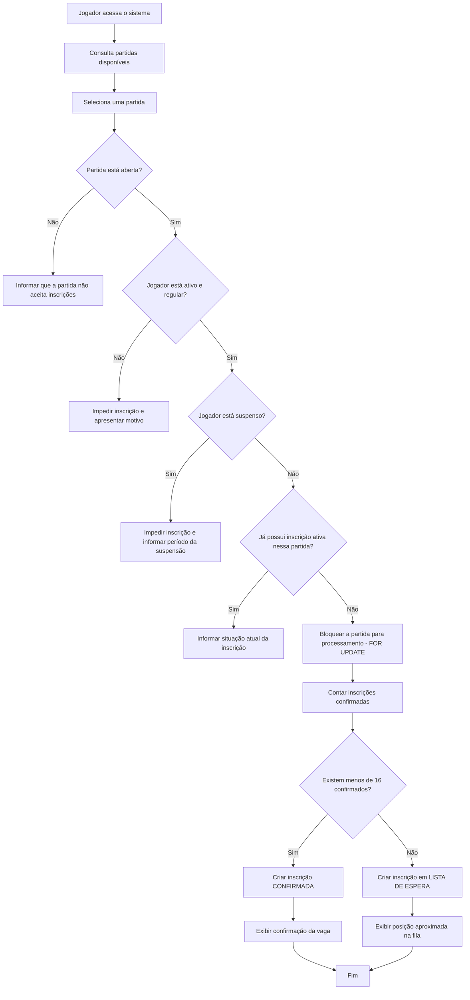
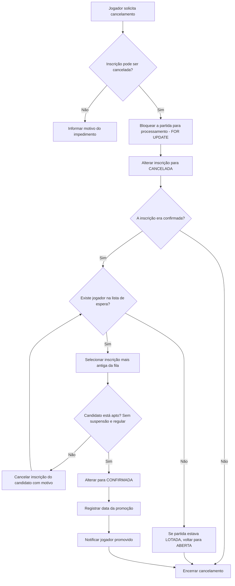
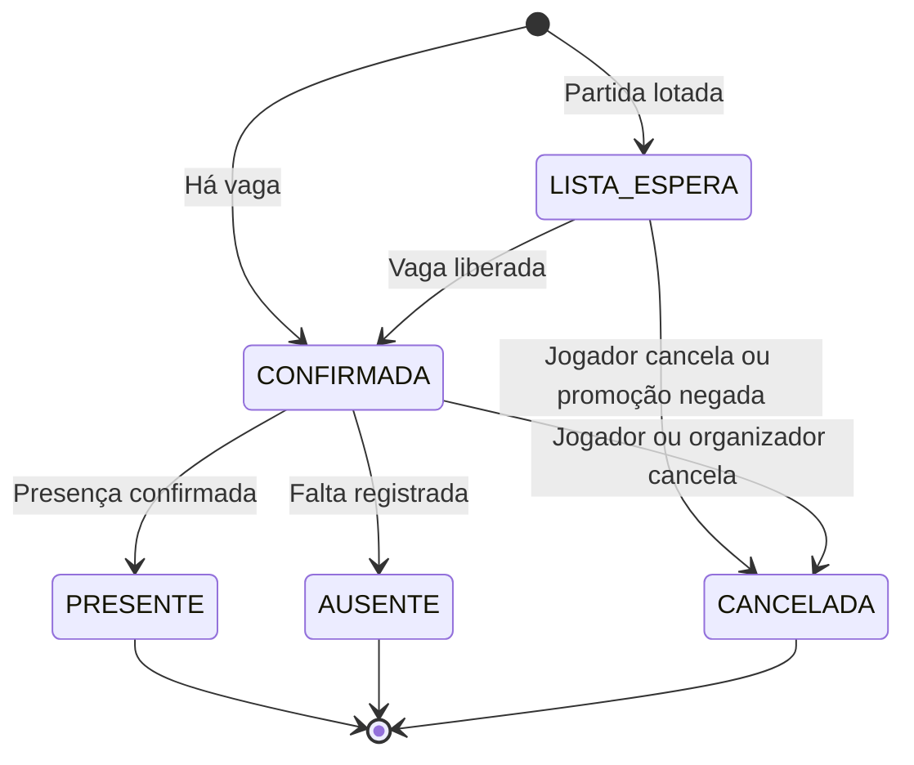
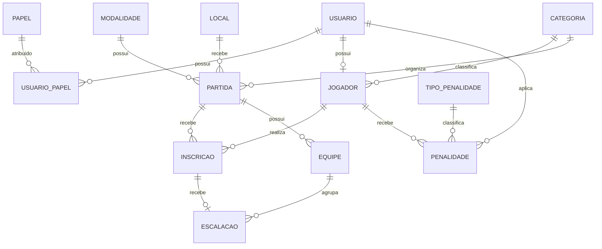

# Design do MVP — Fluxo de Inscrição, Modelo de Dados e Decisões Técnicas

Com base nas regras levantadas em [requisitos.md](requisitos.md), o fluxo principal trata a inscrição confirmada, a lista de espera, o cancelamento, a promoção automática e os impedimentos por suspensão ou situação associativa.

## 1. Decisões adotadas para o MVP

- Qualquer pessoa pode criar uma conta; somente jogadores **aprovados e regulares** podem se inscrever (RN01, UC27).
- A partida comporta até 16 jogadores de linha confirmados; após isso, os próximos entram na **lista de espera** (RN04/RN12).
- Um jogador não pode ter mais de uma inscrição **ativa** na mesma partida; após cancelar, pode se inscrever novamente (RN14).
- Jogadores suspensos ou bloqueados não podem se inscrever (RN08).
- A equipe (Azul ou Amarela) é informada apenas **após a publicação da escalação** (RN05).
- O goleiro não realiza inscrição pelo sistema (RN03).
- A posição na fila é determinada pelo horário da solicitação, sem armazenar um número fixo, evita atualizar toda a fila a cada cancelamento.
- Na promoção, o candidato é **revalidado**; se impedido, o sistema passa ao próximo da fila (RN13).
- Cancelamento que libera vaga sem fila **reabre** a partida lotada (RN15).
- Concorrência: lock **pessimista** (`SELECT ... FOR UPDATE` na partida) nos fluxos de inscrição e cancelamento; o campo `versao` (lock **otimista**) protege apenas as edições da partida pelo organizador.

## 2. Fluxo de inscrição em partida



### Resultado apresentado ao jogador

**Inscrição confirmada**

```text
Inscrição realizada com sucesso.

Partida: Futebol – Série B
Data: 10/08/2026
Horário: 18h
Local: Campo principal
Situação: Vaga confirmada
Equipe: Ainda não definida
```

**Lista de espera**

```text
A partida atingiu o limite de participantes.

Sua inscrição foi adicionada à lista de espera.
Posição atual: 2º
Você será promovido automaticamente caso uma vaga seja liberada.
```

## 3. Caso de uso detalhado — UC06 Inscrever-se em partida

**Ator principal:** Jogador

**Pré-condições:**

- usuário autenticado;
- conta ativa;
- cadastro aprovado como associado (UC27);
- situação associativa regular;
- partida aberta para inscrições;
- jogador não suspenso.

**Pós-condições:**

- inscrição registrada como `CONFIRMADA`; ou
- inscrição registrada como `LISTA_ESPERA`.

### Fluxo principal

1. O jogador consulta as partidas disponíveis.
2. O sistema apresenta data, horário, categoria, local e quantidade de vagas.
3. O jogador seleciona uma partida.
4. O sistema valida a situação do usuário.
5. O sistema verifica suspensões vigentes.
6. O sistema verifica se já existe inscrição ativa do jogador na partida.
7. O sistema verifica a quantidade de inscrições confirmadas (com a partida bloqueada).
8. Havendo vaga, cria uma inscrição confirmada.
9. O sistema exibe a confirmação.
10. A equipe permanece indefinida até a publicação da escalação.

### Fluxos alternativos

| Código | Situação | Resposta do sistema |
|--------|----------|---------------------|
| A01 | Conta bloqueada ou inativa | Impede a inscrição |
| A02 | Cadastro ainda não aprovado | Informa que o cadastro aguarda aprovação |
| A03 | Associado irregular | Impede a inscrição e apresenta orientação |
| A04 | Jogador suspenso | Informa o período da suspensão |
| A05 | Inscrição ativa duplicada | Apresenta a inscrição existente |
| A06 | Partida lotada | Registra o jogador na lista de espera |
| A07 | Partida encerrada | Impede a inscrição |
| A08 | Partida cancelada | Impede a inscrição |
| A09 | Prazo de inscrição encerrado | Informa que o período de inscrição terminou |

## 4. Fluxo de cancelamento e promoção da fila



### Regra de promoção

O sistema seleciona a inscrição mais antiga com status `LISTA_ESPERA`:

```sql
ORDER BY data_solicitacao ASC, id ASC
```

O `id` atua como critério de desempate. A operação de cancelamento e promoção acontece **dentro da mesma transação, com a partida bloqueada** (`FOR UPDATE`), a mesma estratégia e a mesma ordem de bloqueio do fluxo de inscrição, o que impede duas promoções para a mesma vaga e evita deadlocks.

## 5. Estados da inscrição



Estados do MVP: `CONFIRMADA`, `LISTA_ESPERA`, `CANCELADA`, `PRESENTE`, `AUSENTE`.

Não existe estado `PROMOVIDA`: a promoção é registrada pela mudança de status e pelo campo `data_promocao`. Os estados `PRESENTE`/`AUSENTE` "consomem" o estado `CONFIRMADA`, a `data_confirmacao` preserva quem estava confirmado no momento da publicação da escalação.

## 6. Modelo conceitual do banco de dados



## 7. Tabelas principais

### `usuario`

| Campo | Tipo | Observação |
|-------|------|------------|
| id | UUID | Chave primária |
| nome | VARCHAR(150) | Nome completo |
| email | VARCHAR(200) | Único |
| senha_hash | VARCHAR(255) | Nunca armazenar senha aberta |
| status | VARCHAR(20) | PENDENTE, ATIVO, BLOQUEADO ou INATIVO |
| criado_em | TIMESTAMPTZ | Data do cadastro |
| atualizado_em | TIMESTAMPTZ | Última alteração (mantida pela aplicação) |

### `papel`

`JOGADOR`, `ORGANIZADOR`, `ADMINISTRADOR`, um mesmo usuário pode possuir mais de um papel.

### `jogador`

| Campo | Tipo | Observação |
|-------|------|------------|
| id | UUID | Chave primária |
| usuario_id | UUID | Usuário relacionado |
| matricula_associado | VARCHAR(50) | Número de associado |
| situacao_associativa | VARCHAR(20) | PENDENTE, REGULAR ou IRREGULAR |
| categoria_id | BIGINT | Série A, B ou C |
| aprovado_em | TIMESTAMPTZ | Data da aprovação (UC27) |
| aprovado_por | UUID | Administrador responsável |

### `partida`

| Campo | Tipo | Observação |
|-------|------|------------|
| id | UUID | Chave primária |
| modalidade_id | UUID | Inicialmente futebol |
| local_id | UUID | Local da partida |
| categoria_id | BIGINT | Série A, B ou C |
| inicio | TIMESTAMPTZ | Data e horário |
| capacidade | INTEGER | Inicialmente 16 |
| status | VARCHAR(20) | Estado da partida |
| inscricoes_abrem_em | TIMESTAMPTZ | Início das inscrições |
| inscricoes_encerram_em | TIMESTAMPTZ | Encerramento |
| escala_publicada | BOOLEAN | Indica publicação |
| criado_por | UUID | Organizador responsável |
| versao | INTEGER | Lock otimista — edições do organizador |
| criado_em | TIMESTAMPTZ | Data de criação |

Estados: `RASCUNHO`, `ABERTA`, `LOTADA`, `ENCERRADA`, `FINALIZADA`, `CANCELADA`.

O status `LOTADA` é informativo, a partida continua recebendo inscrições na lista de espera, e **volta a `ABERTA`** quando um cancelamento libera vaga sem fila (RN15).

### `inscricao`

| Campo | Tipo | Observação |
|-------|------|------------|
| id | UUID | Chave primária |
| partida_id | UUID | Partida relacionada |
| jogador_id | UUID | Jogador inscrito |
| status | VARCHAR(25) | Estado da inscrição |
| data_solicitacao | TIMESTAMPTZ | Define a ordem da fila |
| data_confirmacao | TIMESTAMPTZ | Confirmação da vaga |
| data_promocao | TIMESTAMPTZ | Promoção da lista |
| data_cancelamento | TIMESTAMPTZ | Cancelamento |
| motivo_cancelamento | VARCHAR(255) | Opcional |
| cancelado_por | UUID | Jogador ou organizador |

**Unicidade:** a restrição vale apenas para inscrições **ativas**, um índice único parcial em `(partida_id, jogador_id)` excluindo `CANCELADA` (RN14). Assim o jogador não se inscreve duas vezes ao mesmo tempo, mas pode voltar após cancelar, e o histórico de cancelamentos fica preservado em linhas próprias.

### `equipe`

| Campo | Tipo |
|-------|------|
| id | UUID |
| partida_id | UUID |
| nome | VARCHAR(50) |
| cor | VARCHAR(20) |
| capacidade | INTEGER |

Para o futebol: Equipe Azul: capacidade 8; Equipe Amarela: capacidade 8. A capacidade da equipe é validada pela aplicação, dentro da transação de escalação.

### `escalacao`

| Campo | Tipo | Observação |
|-------|------|------------|
| id | UUID | Chave primária |
| inscricao_id | UUID | Apenas inscrição confirmada |
| equipe_id | UUID | Azul ou Amarela |
| atribuido_por | UUID | Organizador |
| atribuido_em | TIMESTAMPTZ | Data da atribuição |

Cada inscrição pode possuir no máximo uma escalação.

### `penalidade`

| Campo | Tipo |
|-------|------|
| id | UUID |
| jogador_id | UUID |
| tipo_penalidade_id | UUID |
| inicio | DATE |
| fim | DATE |
| descricao | TEXT |
| status | VARCHAR(20) |
| aplicada_por | UUID |
| aplicada_em | TIMESTAMPTZ |

Uma suspensão está vigente quando `status = ATIVA` e a data atual está entre `inicio` e `fim`.

## 8. SQL inicial para PostgreSQL

> Este SQL é a referência de modelagem; as migrations Flyway (`V1__...`, `V2__...`) serão criadas na branch `feature/modelo-dados` a partir dele.

### Usuários e jogadores

```sql
CREATE EXTENSION IF NOT EXISTS "pgcrypto";

CREATE TABLE usuario (
    id UUID PRIMARY KEY DEFAULT gen_random_uuid(),
    nome VARCHAR(150) NOT NULL,
    email VARCHAR(200) NOT NULL,
    senha_hash VARCHAR(255) NOT NULL,
    status VARCHAR(20) NOT NULL DEFAULT 'PENDENTE',
    criado_em TIMESTAMPTZ NOT NULL DEFAULT CURRENT_TIMESTAMP,
    atualizado_em TIMESTAMPTZ NOT NULL DEFAULT CURRENT_TIMESTAMP,

    CONSTRAINT uk_usuario_email UNIQUE (email),

    CONSTRAINT ck_usuario_status CHECK (
        status IN ('PENDENTE', 'ATIVO', 'BLOQUEADO', 'INATIVO')
    )
);

CREATE TABLE papel (
    id SMALLSERIAL PRIMARY KEY,
    nome VARCHAR(30) NOT NULL UNIQUE
);

CREATE TABLE usuario_papel (
    usuario_id UUID NOT NULL,
    papel_id SMALLINT NOT NULL,

    PRIMARY KEY (usuario_id, papel_id),

    CONSTRAINT fk_usuario_papel_usuario
        FOREIGN KEY (usuario_id) REFERENCES usuario (id),

    CONSTRAINT fk_usuario_papel_papel
        FOREIGN KEY (papel_id) REFERENCES papel (id)
);

CREATE TABLE categoria (
    id BIGSERIAL PRIMARY KEY,
    nome VARCHAR(50) NOT NULL,
    peso INTEGER NOT NULL,
    ativo BOOLEAN NOT NULL DEFAULT TRUE,

    CONSTRAINT uk_categoria_nome UNIQUE (nome)
);

CREATE TABLE jogador (
    id UUID PRIMARY KEY DEFAULT gen_random_uuid(),
    usuario_id UUID NOT NULL,
    matricula_associado VARCHAR(50),
    situacao_associativa VARCHAR(20) NOT NULL DEFAULT 'PENDENTE',
    categoria_id BIGINT,
    aprovado_em TIMESTAMPTZ,
    aprovado_por UUID,

    CONSTRAINT uk_jogador_usuario UNIQUE (usuario_id),
    CONSTRAINT uk_jogador_matricula UNIQUE (matricula_associado),

    CONSTRAINT fk_jogador_usuario
        FOREIGN KEY (usuario_id) REFERENCES usuario (id),

    CONSTRAINT fk_jogador_categoria
        FOREIGN KEY (categoria_id) REFERENCES categoria (id),

    CONSTRAINT fk_jogador_aprovador
        FOREIGN KEY (aprovado_por) REFERENCES usuario (id),

    CONSTRAINT ck_jogador_situacao CHECK (
        situacao_associativa IN ('PENDENTE', 'REGULAR', 'IRREGULAR')
    )
);
```

### Modalidade, local e partida

```sql
CREATE TABLE modalidade (
    id UUID PRIMARY KEY DEFAULT gen_random_uuid(),
    nome VARCHAR(100) NOT NULL,
    ativo BOOLEAN NOT NULL DEFAULT TRUE,

    CONSTRAINT uk_modalidade_nome UNIQUE (nome)
);

CREATE TABLE local_partida (
    id UUID PRIMARY KEY DEFAULT gen_random_uuid(),
    nome VARCHAR(100) NOT NULL,
    descricao VARCHAR(255),
    ativo BOOLEAN NOT NULL DEFAULT TRUE
);

CREATE TABLE partida (
    id UUID PRIMARY KEY DEFAULT gen_random_uuid(),
    modalidade_id UUID NOT NULL,
    local_id UUID NOT NULL,
    categoria_id BIGINT,
    inicio TIMESTAMPTZ NOT NULL,
    capacidade INTEGER NOT NULL DEFAULT 16,
    status VARCHAR(20) NOT NULL DEFAULT 'RASCUNHO',
    inscricoes_abrem_em TIMESTAMPTZ,
    inscricoes_encerram_em TIMESTAMPTZ,
    escala_publicada BOOLEAN NOT NULL DEFAULT FALSE,
    criado_por UUID NOT NULL,
    versao INTEGER NOT NULL DEFAULT 0,
    criado_em TIMESTAMPTZ NOT NULL DEFAULT CURRENT_TIMESTAMP,

    CONSTRAINT fk_partida_modalidade
        FOREIGN KEY (modalidade_id) REFERENCES modalidade (id),

    CONSTRAINT fk_partida_local
        FOREIGN KEY (local_id) REFERENCES local_partida (id),

    CONSTRAINT fk_partida_categoria
        FOREIGN KEY (categoria_id) REFERENCES categoria (id),

    CONSTRAINT fk_partida_criador
        FOREIGN KEY (criado_por) REFERENCES usuario (id),

    CONSTRAINT ck_partida_capacidade CHECK (capacidade > 0),

    CONSTRAINT ck_partida_status CHECK (
        status IN (
            'RASCUNHO', 'ABERTA', 'LOTADA',
            'ENCERRADA', 'FINALIZADA', 'CANCELADA'
        )
    ),

    CONSTRAINT ck_partida_periodo_inscricao CHECK (
        inscricoes_encerram_em IS NULL
        OR inscricoes_abrem_em IS NULL
        OR inscricoes_encerram_em > inscricoes_abrem_em
    )
);
```

### Inscrição

```sql
CREATE TABLE inscricao (
    id UUID PRIMARY KEY DEFAULT gen_random_uuid(),
    partida_id UUID NOT NULL,
    jogador_id UUID NOT NULL,
    status VARCHAR(25) NOT NULL,
    data_solicitacao TIMESTAMPTZ NOT NULL DEFAULT CURRENT_TIMESTAMP,
    data_confirmacao TIMESTAMPTZ,
    data_promocao TIMESTAMPTZ,
    data_cancelamento TIMESTAMPTZ,
    motivo_cancelamento VARCHAR(255),
    cancelado_por UUID,

    CONSTRAINT fk_inscricao_partida
        FOREIGN KEY (partida_id) REFERENCES partida (id),

    CONSTRAINT fk_inscricao_jogador
        FOREIGN KEY (jogador_id) REFERENCES jogador (id),

    CONSTRAINT fk_inscricao_cancelado_por
        FOREIGN KEY (cancelado_por) REFERENCES usuario (id),

    CONSTRAINT ck_inscricao_status CHECK (
        status IN (
            'CONFIRMADA', 'LISTA_ESPERA', 'CANCELADA',
            'PRESENTE', 'AUSENTE'
        )
    )
);

-- RN14: apenas uma inscrição ativa por jogador/partida;
-- linhas CANCELADA ficam de fora e preservam o histórico.
CREATE UNIQUE INDEX uk_inscricao_ativa
    ON inscricao (partida_id, jogador_id)
    WHERE status <> 'CANCELADA';

CREATE INDEX idx_inscricao_partida_status
    ON inscricao (partida_id, status);

CREATE INDEX idx_inscricao_lista_espera
    ON inscricao (partida_id, data_solicitacao)
    WHERE status = 'LISTA_ESPERA';
```

### Equipes e escalação

```sql
CREATE TABLE equipe (
    id UUID PRIMARY KEY DEFAULT gen_random_uuid(),
    partida_id UUID NOT NULL,
    nome VARCHAR(50) NOT NULL,
    cor VARCHAR(20) NOT NULL,
    capacidade INTEGER NOT NULL DEFAULT 8,

    CONSTRAINT fk_equipe_partida
        FOREIGN KEY (partida_id) REFERENCES partida (id),

    CONSTRAINT uk_equipe_partida_cor UNIQUE (partida_id, cor),

    CONSTRAINT ck_equipe_capacidade CHECK (capacidade > 0)
);

CREATE TABLE escalacao (
    id UUID PRIMARY KEY DEFAULT gen_random_uuid(),
    inscricao_id UUID NOT NULL,
    equipe_id UUID NOT NULL,
    atribuido_por UUID NOT NULL,
    atribuido_em TIMESTAMPTZ NOT NULL DEFAULT CURRENT_TIMESTAMP,

    CONSTRAINT uk_escalacao_inscricao UNIQUE (inscricao_id),

    CONSTRAINT fk_escalacao_inscricao
        FOREIGN KEY (inscricao_id) REFERENCES inscricao (id),

    CONSTRAINT fk_escalacao_equipe
        FOREIGN KEY (equipe_id) REFERENCES equipe (id),

    CONSTRAINT fk_escalacao_usuario
        FOREIGN KEY (atribuido_por) REFERENCES usuario (id)
);
```

### Penalidades

```sql
CREATE TABLE tipo_penalidade (
    id UUID PRIMARY KEY DEFAULT gen_random_uuid(),
    nome VARCHAR(100) NOT NULL,
    descricao VARCHAR(255),
    dias_suspensao_padrao INTEGER NOT NULL DEFAULT 0,
    ativo BOOLEAN NOT NULL DEFAULT TRUE,

    CONSTRAINT ck_tipo_penalidade_dias CHECK (dias_suspensao_padrao >= 0)
);

CREATE TABLE penalidade (
    id UUID PRIMARY KEY DEFAULT gen_random_uuid(),
    jogador_id UUID NOT NULL,
    tipo_penalidade_id UUID NOT NULL,
    inicio DATE NOT NULL,
    fim DATE NOT NULL,
    descricao TEXT,
    status VARCHAR(20) NOT NULL DEFAULT 'ATIVA',
    aplicada_por UUID NOT NULL,
    aplicada_em TIMESTAMPTZ NOT NULL DEFAULT CURRENT_TIMESTAMP,

    CONSTRAINT fk_penalidade_jogador
        FOREIGN KEY (jogador_id) REFERENCES jogador (id),

    CONSTRAINT fk_penalidade_tipo
        FOREIGN KEY (tipo_penalidade_id) REFERENCES tipo_penalidade (id),

    CONSTRAINT fk_penalidade_usuario
        FOREIGN KEY (aplicada_por) REFERENCES usuario (id),

    CONSTRAINT ck_penalidade_periodo CHECK (fim >= inicio),

    CONSTRAINT ck_penalidade_status CHECK (
        status IN ('ATIVA', 'ENCERRADA', 'CANCELADA')
    )
);

CREATE INDEX idx_penalidade_jogador_periodo
    ON penalidade (jogador_id, inicio, fim);
```

## 9. Lógica transacional da inscrição

A validação de capacidade não pode ocorrer apenas no frontend. O backend bloqueia a partida durante a operação:

```java
@Transactional
public InscricaoResponse inscrever(UUID partidaId, UUID usuarioId) {
    Jogador jogador = jogadorRepository.buscarPorUsuario(usuarioId)
        .orElseThrow(() -> new RegraNegocioException(
            "O usuário não possui perfil de jogador."
        ));

    validarJogadorAtivoERegular(jogador);
    validarAusenciaDeSuspensao(jogador);

    Partida partida = partidaRepository.buscarPorIdComBloqueio(partidaId)
        .orElseThrow(() -> new RecursoNaoEncontradoException(
            "Partida não encontrada."
        ));

    validarPartidaAberta(partida);
    validarPeriodoDeInscricao(partida);

    if (inscricaoRepository.existeInscricaoAtiva(partidaId, jogador.getId())) {
        throw new RegraNegocioException(
            "O jogador já possui inscrição ativa nessa partida."
        );
    }

    long confirmados = inscricaoRepository.contarConfirmados(partidaId);

    StatusInscricao status =
        confirmados < partida.getCapacidade()
            ? StatusInscricao.CONFIRMADA
            : StatusInscricao.LISTA_ESPERA;

    Inscricao inscricao = new Inscricao(partida, jogador, status);

    if (status == StatusInscricao.CONFIRMADA) {
        inscricao.confirmar();

        if (confirmados + 1 == partida.getCapacidade()) {
            partida.marcarComoLotada();
        }
    }

    inscricaoRepository.save(inscricao);

    return montarResposta(inscricao);
}
```

Consulta da partida com bloqueio:

```sql
SELECT * FROM partida WHERE id = :partida_id FOR UPDATE;
```

Enquanto a transação estiver ativa, outra solicitação para a mesma partida aguarda, impedindo que duas pessoas ocupem simultaneamente a última vaga.

**O cancelamento usa o mesmo bloqueio, na mesma ordem** (partida primeiro): cancela a inscrição, e se ela era confirmada, promove o primeiro candidato apto da fila (revalidando suspensão e situação associativa, RN13) ou, sem fila, reverte `LOTADA` para `ABERTA` (RN15). Tudo em uma única transação.

## 10. Consulta da posição na lista de espera

A posição é calculada sem armazená-la:

```sql
SELECT COUNT(*) + 1 AS posicao
FROM inscricao anterior
WHERE anterior.partida_id = :partida_id
  AND anterior.status = 'LISTA_ESPERA'
  AND (anterior.data_solicitacao, anterior.id)
      < (:data_solicitacao, :inscricao_id);
```

## 11. Ordem de implementação

1. `usuario`, `papel`, `usuario_papel` e autenticação;
2. `categoria`, `jogador` e aprovação de cadastro (UC27);
3. `modalidade`, `local_partida` e `partida`;
4. inscrição confirmada;
5. lista de espera;
6. cancelamento com promoção automática;
7. penalidades e bloqueio por suspensão;
8. equipes e escalação;
9. presença e ausência;
10. testes de concorrência.

O ponto tecnicamente mais importante é o teste com duas inscrições simultâneas disputando a última vaga, demonstrando que a capacidade é aplicada no backend com consistência garantida pelo banco.
